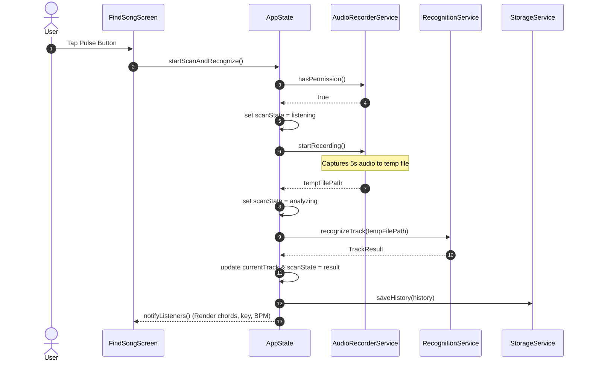

# Sonic Pulse — Architecture Documentation

This document describes the high-level architecture, data flows, and state lifecycle of the Sonic Pulse application.

---

## 1. System Architecture Diagram

```mermaid
graph TD
    subgraph Presentation ["Presentation Layer (Flutter)"]
        UI_Scan["FindSongScreen (Pulse Scanner)"]
        UI_Home["HomeScreen (Feed & Discovery)"]
        UI_Lib["LibraryScreen (Saved & History)"]
        UI_Analyze["AIAnalyzerScreen (Deep Chords/Key View)"]
    end

    subgraph StateManagement ["State Management Layer"]
        AppState["AppState (ChangeNotifier Provider)"]
    end

    subgraph DeviceServices ["Device & Native Services"]
        AudioRec["AudioRecorderService (package:record)"]
        Storage["StorageService (SharedPreferences)"]
    end

    subgraph RemoteServices ["Networking & Backend"]
        RecService["RecognitionService"]
        Config["ApiConfig (useMockResponses toggle)"]
        PythonBackend["Python FastAPI/Flask Model (:5001)"]
    end

    UI_Scan -->|User taps scan| AppState
    UI_Home -->|Select track| AppState
    UI_Lib -->|Toggle save/filter| AppState
    AppState -->|Start/Stop recording| AudioRec
    AudioRec -->|Temporary audio file| RecService
    RecService -->|Check config| Config
    RecService -->|POST /api/recognize| PythonBackend
    RecService -.->|Simulated response if mock| AppState
    PythonBackend -.->|TrackResult JSON| RecService
    AppState -->|Persist history & favorites| Storage
    AppState -->|Reactive notifyListeners()| Presentation
```

---

## 2. Recognition Data Flow



---

## 3. Storage & Schema

The application persists user data locally using `SharedPreferences`:

| Storage Key | Type | Description |
|---|---|---|
| `sonic_pulse_history` | JSON String list | All previously identified tracks, ordered by most recent first |
| `sonic_pulse_saved` | JSON String list | User's favorite / bookmarked tracks |

Each track serialized inside these lists conforms to the `TrackResult` model:
- `id`, `title`, `artist`, `album`, `cover_url`, `key`, `bpm`, `confidence`, `chords`, `mood`, `camelot`, `time_sig`, `recognized_at`.
